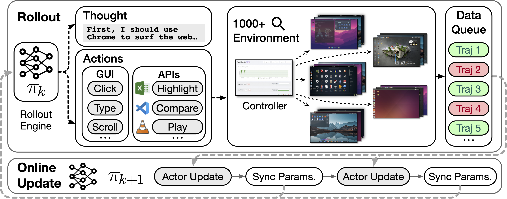
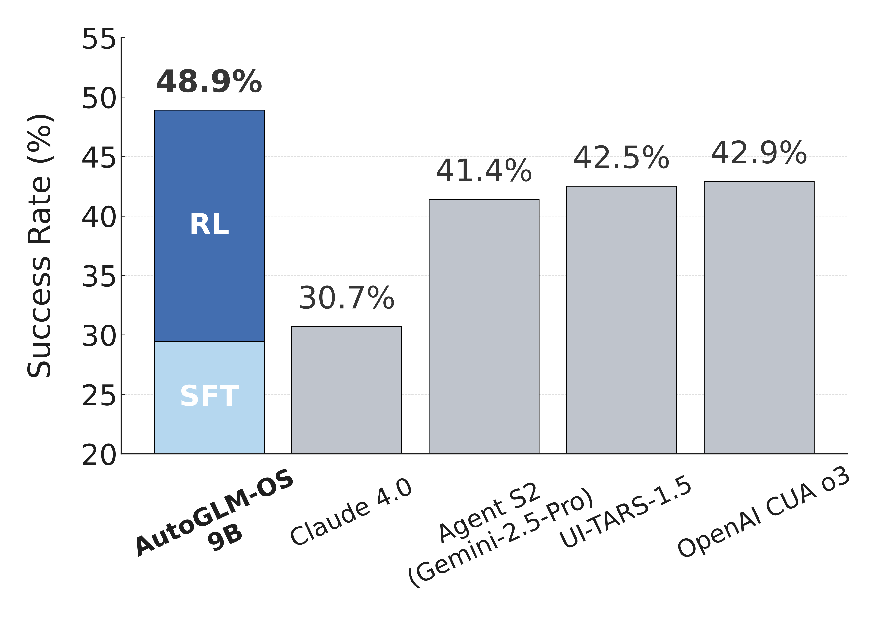

# ComputerRL: Scaling End-to-End Online Reinforcement Learning for Computer Use Agents

<p align="center">
   <a href="https://arxiv.org/abs/2508.14040" target="_blank">📃 Paper </a>
   &nbsp;|&nbsp;
   <a href="https://docs.google.com/spreadsheets/d/1wFHvf3mb42j74JtAww4CTOc7tdF8KIfGZyRQyLhh5pc/edit?usp=sharing" target="_blank">📊 OfficeWorld Leaderboard</a>
</p>

_Read this in [中文](README_zh.md)._

This repository is the code repository for ComputerRL, which is based on modifications and simplifications of the OSWorld repository. ComputerRL focuses on end-to-end online reinforcement learning methods for training computer use agents. This project has been optimized and simplified based on the OSWorld benchmark environment, providing a more focused and efficient experimental platform for computer use research.

<p align="center">
    <br>
    <em>We introduce an API-GUI action paradigm that seamlessly integrates automatically constructed APIs with GUI actions to improve agent efficiency and effectiveness. A large-scale parallel desktop environment with 1,000+ real-world instances, combined with an asynchronous RL framework, enables efficient sampling and robust agent training.</em>
</p>

<p align="center">
    <br>
    <em>The success rates of agents on OSWorld.</em>
</p>

## 🌱 Environment

### 🖥️ Check for KVM Support

We recommend running the VM with KVM support for better performance. To check if your system supports KVM, run the following command:
```bash
egrep -c '(vmx|svm)' /proc/cpuinfo
```
If the output is greater than 0, your system supports KVM. ✅

### 🐳 Install Docker

Please refer to the [Docker Installation Guide](https://docs.docker.com/desktop/setup/install) to install Docker on your machine.

### 📥 Download the Image

Download the official image from [ubuntu_osworld](https://huggingface.co/datasets/xlangai/ubuntu_osworld).

---

## 🧪 Experiments

### 📦 Install Dependencies

```bash
pip install -r requirements.txt
```

### 📂 Download Experiment Files

All experiment files will be cached under `./cache`.

- **OSWorld:** You can refer to the OSWorld repository to conveniently download all cache files.
- **OfficeWorld:** Download the experiment files from [Huggingface/OfficeWorld-Cache](fake—url) and extract them into the `./cache` directory.

### 🤖 Deploy the Model

There are two types of models: text-only and multimodal. You can download models via [Huggingface/AutoGLM-OS](fake—url) and specify the model name using the `--model` parameter.

```bash
pip install "sglang[all]"  # if not installed

python -m sglang.launch_server \
  --model zai-org/autoglm-os-9b \
  --host 0.0.0.0 --port 30000 --served-model-name autoglm-os
```

### 🚀 Run Experiments

Reproduce the results on OSWorld by running the following scripts.

#### 🔐 Environment Variables
```bash
# Set up your API
export OPENAI_BASE_URL="https://api-gateway.glm.ai/v1"
export OPENAI_API_KEY="API-KEY"
```

#### 🔄 Single-Process Test

```bash
# If using a multimodal model, please use run_autoglm_v.py
python run_autoglm.py \
    --provider_name docker \
    --path_to_vm Ubuntu/Ubuntu.vmx \
    --headless \
    --max_steps 15 \
    --test_all_meta_path ./evaluation_examples/test_nogdrive.json
```

#### ⚡ Parallel Test

```bash
# If using a multimodal model, please use run_multienv_autoglm_v.py
python run_multienv_autoglm.py \ 
    --provider_name docker \
    --path_to_vm Ubuntu/Ubuntu.vmx \
    --headless \
    --num_workers 20 \
    --max_steps 15 \
    --test_all_meta_path ./evaluation_examples/test_nogdrive.json
```

### 📊 View Experiment Results

Result files are cached under `./results`. Run the following script to view the scores:

```bash
python show_result.py
```

### 🧹 Clean Up Docker Images

After finishing your experiments, you may have leftover Docker images. Clean them up with:

```bash
docker stop $(docker ps -q) && docker rm $(docker ps -a -q)
```

---

## 🏢 OfficeWorld Benchmark

The OfficeWorld benchmark is built upon [SpreadsheetBench](https://github.com/RUCKBReasoning/SpreadsheetBench), [PPTC](https://github.com/gydpku/PPTC), and in-house developed Writer domain tasks.  
Tasks are adapted as needed to fit into the OSWorld framework, enabling systematic evaluation of agent capabilities in office-oriented scenarios.

### ▶️ Running the OfficeWorld Benchmark

Run the following command to evaluate your agent on the OfficeWorld benchmark:

```bash
python run_multienv_autoglm.py \
    --provider_name docker \
    --path_to_vm Ubuntu/Ubuntu.vmx \
    --headless \
    --num_workers 20 \
    --max_steps 15 \
    --test_all_meta_path ./evaluation_examples/test_office.json
```

### 🏆 Leaderboard

Check out the leaderboard [here](https://docs.google.com/spreadsheets/d/1wFHvf3mb42j74JtAww4CTOc7tdF8KIfGZyRQyLhh5pc/edit?usp=sharing)! 🚀

If you would like to add your results to the leaderboard, please email [`hanyullai@outlook.com`](mailto:hanyullai@outlook.com).

## 📄 Citation

```
@misc{lai2025computerrl,
    title={ComputerRL: Scaling End-to-End Online Reinforcement Learning for Computer Use Agents}, 
    author={Hanyu Lai and Xiao Liu and Yanxiao Zhao and Han Xu and Hanchen Zhang and Bohao Jing and Yanyu Ren and Shuntian Yao and Yuxiao Dong and Jie Tang},
    year={2025},
    eprint={2508.14040},
    archivePrefix={arXiv},
    primaryClass={cs.AI},
    url={https://arxiv.org/abs/2508.14040}, 
}
```